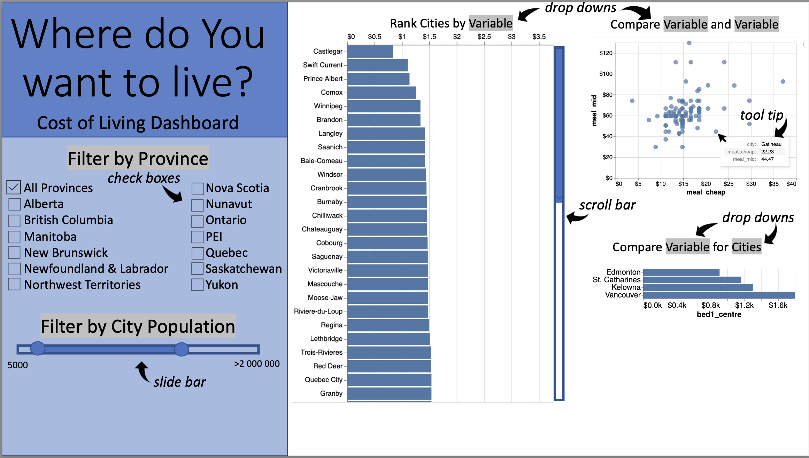

# Welcome to the Cost of living Dashboard!

## Who is this dashboard for?

With inflation at an all-time high and various rates of affordability across the country, many Canadians just like you find themselves considering a relocation. With a lot of confusion surrounding the varying tax rates, cost of goods, rent, and other major expenditures across Canada, it is difficult for all of us to determine the affordability of different regions. If there was an interactive tool to outline the cost of major goods and price indices across different regions in Canada, it could help to determine where to live given specific needs. This is why you find yourself here, looking at the Cost of Living Dashboard. Ordinary Canadians deserve access to personalized information to help make an informed decision about where to live. You are here likely because you are either a young grad looking to set down some roots, or you're a recent retiree looking for an affordable place to enjoy your well-deserved retirement. If you're from either of these groups, don't fret, because this dashboard is here to help make your decision clearer and easier! Visit the link at the bottom of this page to visit the deployed Dashboard!

## Who can help develop the dashboard?

We welcome any contributions! You may be a government employee with new data to help update the dashboard, or you may be a good samaritan with inside tips having recently relocated in Canada due to affordability issues. Either way, you've come to the right place and here are some details on how to contribute.

To help contribute to this dashboard, you can clone this GitHub repo and contribute to the code files to incorporate your work into the Dash layout. Run the code to practice how Dash operates, and how the local copy can be viewed an refreshed. The app is deployed on Heroku, so after updating the GitHub documents, you will need to copy the changes over into Heroku.

## Dashboard Details

The app's landing page consists of a sidebar with the name and short description of the dashboard, as well as features to filter the information used in the main graphs. A user may filter by province as well as by city population. The first graph is a barchart illustrating the cost of an item, chosen by the user through a dropdown menu, by city and sorted in ascending order. A scrollbar is avaiable to scroll through all values if necessary. In a different barchart, users may choose which specific cities (through dropdowns) they want to compare the cost of an item of. A scatterplot is built from user's choice of two variables (through dropdowns), allowing the user to compare the relative costs and see which city the data belongs to from a tooltip. 

Stretch goals:
- grouping variables into categories to add filtering option (restaurants, market, leisure, etc)
- adding a plot to compare many specific variables for many specific cities (scatterplot, or bubble chart)
- adding a map of Canada which interactively shows city locations

Pleae find our app on Heroku: [Cost-of-living_Dashboard](https://cost-of-living.herokuapp.com/)

