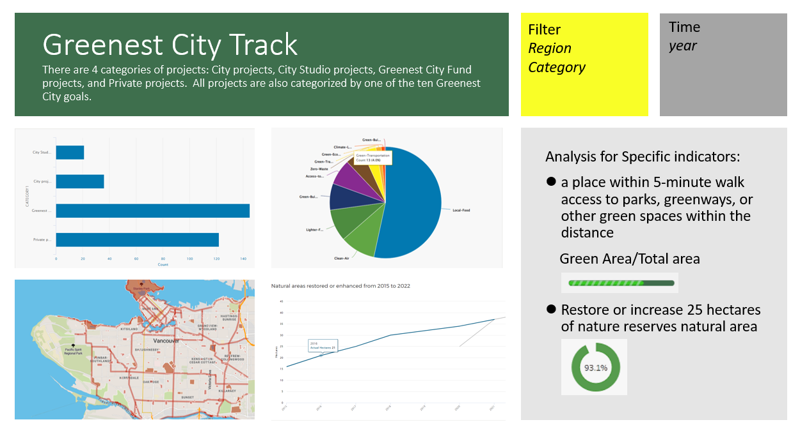

# Dataset Exploration

## Ricky's Brainstorming
### Global Cost of Living
Kaggle data scraped: https://www.kaggle.com/datasets/mvieira101/global-cost-of-living?select=cost-of-living_v2.csv

Original dashboard: https://www.numbeo.com/cost-of-living/
( need to give appropriate credit; didn’t check for the other ones ) 

#### Columns:
city/country, cost of 50 items

#### Pros:
- Data updated dec 2022 it looks like (2nd version)
- Lots of data points
- Could drop down by country and by city
- Sliding scale of price point, controls which city is included in plot?

#### Cons:
- Crowd sourced?
- Currency probably not CAD

Idea:
- Limit data to only canadian info to make easier / cleaner
- Audience: people who want to decide where to live based off of cost of living of different things
- Plot by province (extra work to sort cities by province, could find way to scrape automate it (probably can find city wikipedia page then scrape province))
- Interactive visualizations: slider of range of cost for specific item, only includes cities that meet criteria
- Drop down by province if manage
- Could plot cost of item vs item (scatter plot) by city, see if trendlines
- Either include all columns or choose which ones to make cleaner experience
- Interactive choose which cities to compare
- provincial averages top down aggregation


## Sophie's Brainstorming
### Vancouver Greenest City Action Plan
The Greenest City Action Plan will let Vancouver residents enjoy unparalleled green space, build the most spectacular urban forest in the world.   
Specific indicators: 
1. In 2020, secure everyone a place within a 5-minute walk access to parks, greenways, or other green spaces within the distance  
```5 minute walk is around one quarter mile, maybe we can divide the area with squares and add parks and greenway info into the map to check ```
- Public green land area
    - [Parks](https://opendata.vancouver.ca/explore/dataset/parks/table/) includes the surface area of each parks
    - [Greenways](https://opendata.vancouver.ca/explore/dataset/greenways/information/) with two status: active, proposed 


2. Restore or increase 25 hectares of nature reserves natural area
- [Natural areas restored or enhanced](https://opendata.vancouver.ca/pages/indicator/?q=cardid%3D76)
- [Trees planted from 2010 to 2021](https://opendata.vancouver.ca/pages/indicator/?q=cardid%3D75) 


#### Project Dataset:
The dataset is a list of projects that are part of the initiatives under the Greenest City 2020 Action Plan.  
There are 4 categories of projects: City projects, City Studio projects, Greenest City Fund projects and Private projects.  All projects are also categorized by one of the ten Greenest City goals. For projects to be included they must be a substantial project located in Vancouver, initiated since the formation of the Greenest City Action Team (2010), and contribute to a Greenest City goal.

- [Greenest City projects](https://opendata.vancouver.ca/explore/dataset/greenest-city-projects/information/) there is no timeline for these projects.


Other general criteria:
- Public Green Areas Per Capita 

**There are map and chart builder in the web, we may use it for proposal**   
For example, here is my draft dashboard
 


## Madison's Brainstorming

1 - forest fires in BC - interactive dashboard for past fires, and could be used for active fires during the fire season for BC residents
*** conditional on if we learn how to do maps, because that would be the coolest feature - https://www2.gov.bc.ca/gov/content/safety/wildfire-status/about-bcws/wildfire-statistics

2 - National forest fire database - http://nfdp.ccfm.org/en/data/fires.php

3 - Canadian Environment data including air/climate, environmental economic, environmental protection tech, ecosystems & biodiversity, natural disasters, waste, water
All found via this general link here - https://www.statcan.gc.ca/en/subjects-start/environment
Full disclosure, they have 'dashboards' available on the website, but they're through PowerBI and they kinda suck, so creating one would be a huge value add to make it actually functional.

4 - Historical Climate Data - https://climate.weather.gc.ca/
Split up by Province/Region but we could web scrape and combine them all, then create the dashboard to compare changes over time?
